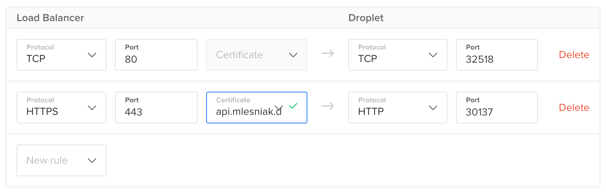

# Overview

This is a playground for misc. go frameworks usable in a production system.

    http https://api.mlesniak.dev/api number:=30

## Add loadbalancer forwarding rule in Digital Ocean for HTTPS access

## Add secret logging token

    echo -n "TOKEN"|kubectl create secret generic sematext-token --from-file=token=/dev/stdin

## Enable filebeat kubernetes authentication

Given the error message

    Failed to list *v1.Pod: pods is forbidden: User "system:serviceaccount:default:default" cannot list resource "pods" in API group "" at the cluster scope

execute

    kubectl create clusterrolebinding default-view --clusterrole=view --serviceaccount=default:default

Note: the creation of the role is now executed in the `yaml` file, but since it was quite difficult to find information about this problem
online I leave it here for now.

# Next steps

- [ ] Use dedicated branch for deployment and deploy only, if a commit is in this branch
- [ ] Rename kubernetes.container.name to service in log files (using filebeat configuration)
- [ ] Extract log package
- [ ] Extract computation service
- [ ] JWT middleware in echo?
- [ ] Think about keycloak?
- [ ] Add integration tests

